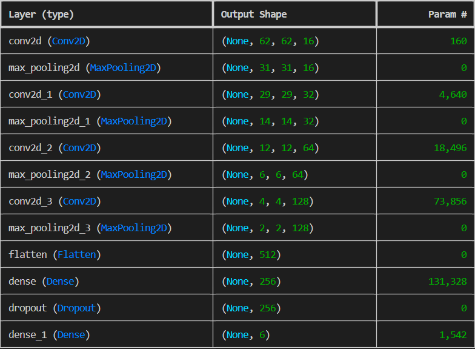
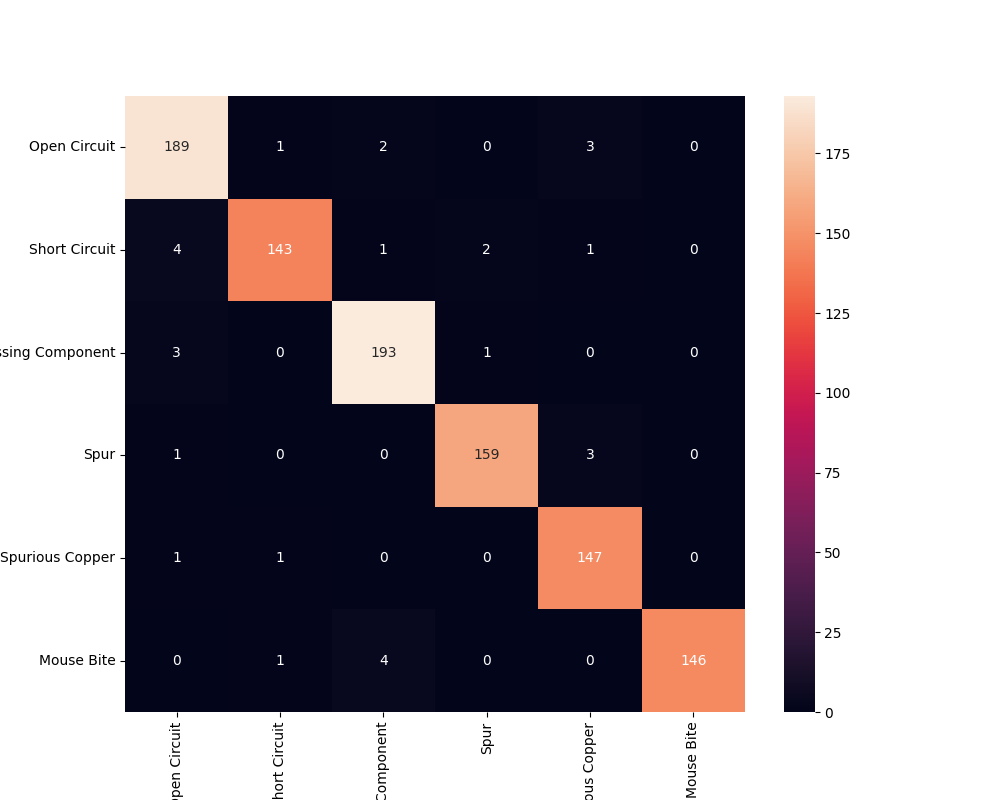
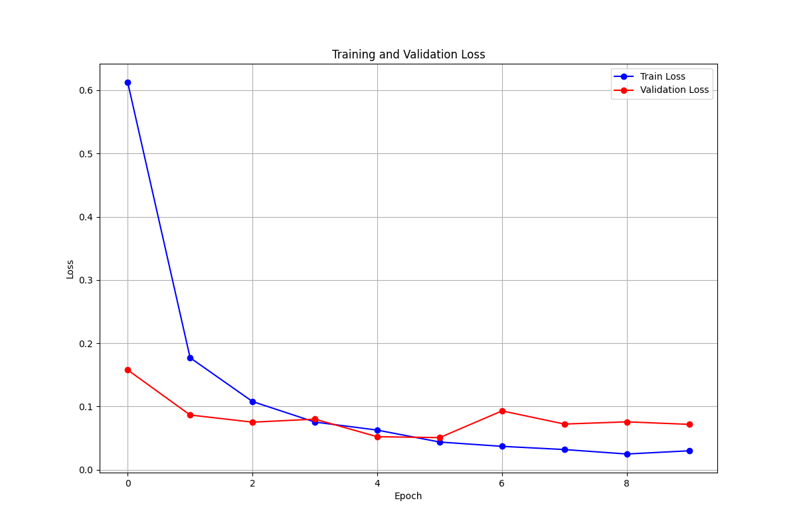
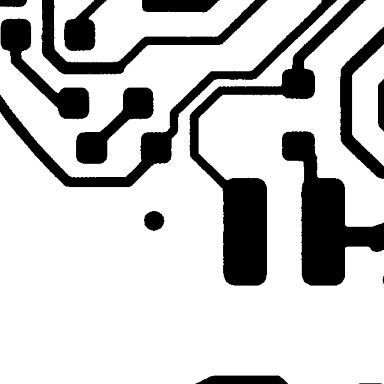
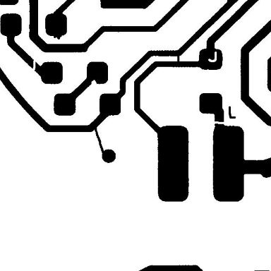

# Automated PCB Defect Detection and Classification System

## 📌 Project Overview
This project implements an end-to-end pipeline for identifying and categorizing defects on Printed Circuit Boards (PCBs). The system leverages a hybrid approach: **Traditional Computer Vision** for precise defect localization and **Deep Learning** for intelligent classification.

---

## 🛠 Methodology & Pipeline

### 1. Image Preprocessing & Defect Detection (XOR Logic)
The system first localizes potential defects by comparing the **Test Image** with a **Template Image**. 
* **Algorithm:** Bitwise XOR operation is applied between the two aligned images to highlight discrepancies.
* **Refinement:** Morphological operations (Closing/Opening) and Dilate filtering are used to magnify defect, followed by Contour Detection to isolate defect regions.

### 2. Defect Cropping & Normalization
Once the defect coordinates are identified via Bounding Boxes:
* Regions of interest (ROIs) are cropped with a padding to provide context for the classifier.
* All crops are resized to a fixed **64x64** resolution.
* Grayscale conversion and pixel normalization ([0, 1]) are applied to ensure input consistency.

### 3. Model Architecture (CNN)
The classification engine is a custom **Convolutional Neural Network (CNN)** designed for high-speed inference:
* **Input Layer:** 64x64x1 (Grayscale).
* **Feature Extraction:** Multiple Conv2D layers with ReLU activation and MaxPooling for spatial invariance.
* **Regularization:** Dropout layers to prevent overfitting.
* **Output:** Fully connected layers with Softmax activation to classify defect types (e.g., Short, Open, Mouse bite).

## 📊 Evaluation & Results

### Model Performance
The CNN model achieved a high level of accuracy on the test set, ensuring reliable classification even for subtle manufacturing flaws.

* **Accuracy on the test dataset:** `97.14%`

 
* **Validation Loss:** 

### Integrated Pipeline Testing
The combined system (Detection + Classification) was tested on unseen PCB layouts. The pipeline successfully localizes the error and assigns a label with a confidence score.

Template Image + Test Image ➔ **Preprocessing** ➔ Defect Localization ➔ **CNN Classification** ➔ Final Result
* **Template image** and **Test image**
                                                        

---

## ⏱ Performance Benchmarking (Latency)

* **Average End-to-End Latency:** `418ms`

| Stage | Process | Time (ms) | Visualization |
| :--- | :--- | :--- | :--- |
| **Detection** | Preprocessing + XOR + Contours | ~6ms | █▒▒▒▒▒▒▒▒▒ (1.4%) |
| **Classification**| CNN Inference (Batch Mode) | ~412ms | ██████████ (98.6%) |

---

